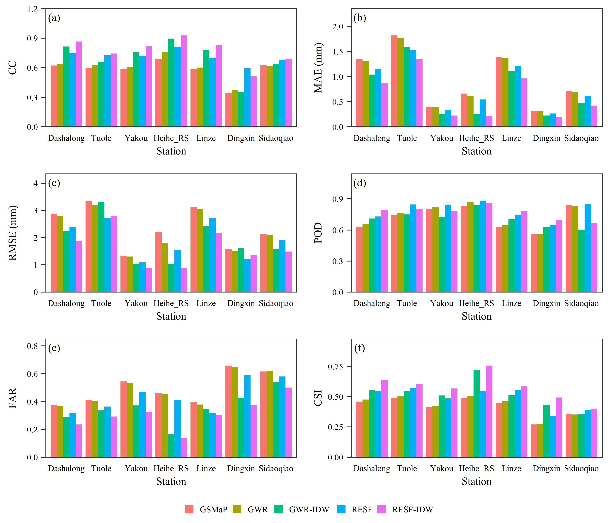

[点击下载本文全部代码](R语言柱状图绘制模板_代码.R)

[点击下载本文全部数据](R语言柱状图绘制模板_数据.zip)

在熟悉绘图函数及其参数设置后，形成一套通用模板有助于提高制图效率。本文展示了几种基于R语言ggplot2包的柱状图绘制代码。

--- 

# 一、单一柱状图

```r
library(ggplot2)

## read data
re <- read.csv("fig1.csv")

## plot
ggplot(data = re,
       mapping = aes(x = Metric,
                     y = Values,
                     fill = Method))+
  geom_col(position = 'dodge')+
  labs(y = "Frequency",
       x = "Precipitation event")+
  scale_x_discrete(expand = c(0.18,0.18))+
  scale_y_continuous(expand = c(0.002,0,0.12,0))+
  theme_bw() +
  theme(text = element_text(family="serif",
                            size = 7),
        panel.grid = element_blank(),
        legend.position = "bottom",
        legend.box.spacing = unit(0, "cm"),
        legend.key.size = unit(7, "pt"),
        axis.ticks.x = element_blank(),
        axis.ticks.y = element_line(linewidth = 0.3),
        axis.text = element_text(color = "black"))

## save
ggsave("fig1.jpg",
       width = 9,
       height = 7,
       units = "cm",
       dpi = 600)
```


# 二、多柱状图——基于分面

```r
library(ggplot2)

## read data
re <- read.csv("fig2.csv")

## plot
ggplot(data = re,
       mapping = aes(x = Metric,
                     y = Values,
                     fill = Method)) +
  geom_col(position = 'dodge') +
  labs(y = "Frequency",
       x = "Precipitation event") +
  scale_x_discrete(expand = c(0.18,0.18)) +
  scale_y_continuous(expand = c(0.0025,0,0.12,0)) +
  facet_wrap(Year~., ncol = 3) +
  geom_text(aes(label = label),
            x = 0.55,
            y = max(re$Values, na.rm = T)*1.05,
            family="serif",
            hjust = 0,
            size = 2.5) +
  theme_bw() +
  theme(text = element_text(family="serif",
                            size = 7),
        strip.text = element_blank(),
        panel.grid = element_blank(),
        legend.position = "bottom",
        legend.title = element_blank(),
        legend.box.spacing = unit(0, "cm"),
        legend.key.size = unit(7, "pt"),
        axis.ticks.x=element_blank(),
        axis.ticks.y=element_line(linewidth=0.3),
        axis.text = element_text(color = "black"))

## save
ggsave("fig2.jpg",
       width = 14,
       height = 6,
       units = "cm",
       dpi = 600)
```



# 三、多柱状图——基于子图

```r
library(ggplot2)
library(ggpubr)

## read data
re <- read.csv("fig3.csv")
re$Station <- as.character(re$Station)

## plotfun
plotfun <- function(data, ylab, label){
  ggplot(data = data,
         mapping = aes(x = Station,
                       y = Values,
                       fill = Method)) +
    geom_col(position = 'dodge') +
    scale_y_continuous(expand = c(0.0035,0,0.08,0)) +
    scale_x_discrete(labels = c("Dashalong",
                                "Tuole",
                                "Yakou",
                                "Heihe_RS",
                                "Linze",
                                "Dingxin",
                                "Sidaoqiao")) +
    labs(x = "Station",
         y = ylab) +
    annotate("text",
             x = 0.65,
             y = max(data$Values)*1.2,
             label = label,
             family="serif",
             size = 2.5) +
    theme_bw() +
    theme(text = element_text(family="serif",
                              size = 7),
          panel.grid = element_blank(),
          legend.position = "bottom",
          legend.title = element_blank(),
          legend.key.size = unit(7, "pt"),
          legend.box.spacing = unit(0, "cm"),
          axis.ticks.x = element_blank(),
          axis.ticks.y = element_line(linewidth=0.3),
          axis.text = element_text(color = "black"))
}

## plot
a <- plotfun(re[re$Metric=="CC",], "CC", "(a)")
b <- plotfun(re[re$Metric=="MAE",], "MAE (mm)", "(b)")
c <- plotfun(re[re$Metric=="RMSE",], "RMSE (mm)", "(c)")
d <- plotfun(re[re$Metric=="POD",], "POD", "(d)")
e <- plotfun(re[re$Metric=="FAR",], "FAR", "(e)")
f <- plotfun(re[re$Metric=="CSI",], "CSI", "(f)")

ggarrange(a,b,c,d,e,f,
          ncol = 2,
          nrow = 3,
          align = "hv",
          common.legend = T,
          legend = "bottom")

## save
ggsave("fig3.jpg",
       width = 14,
       height = 12,
       units = "cm",
       dpi = 600)
```


